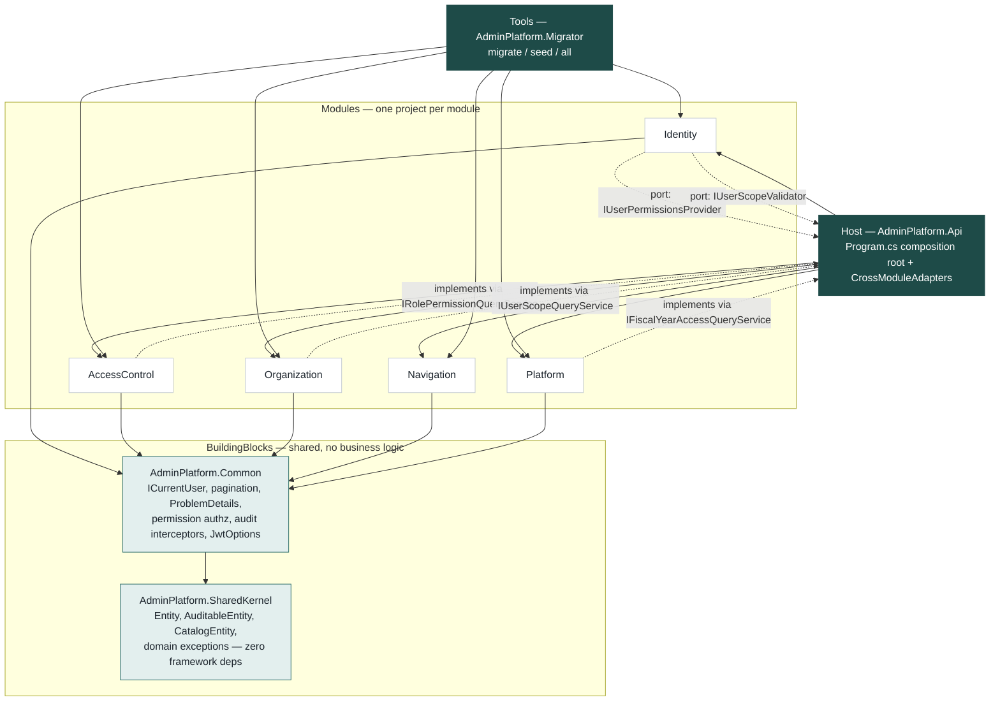

# Architecture

Modular Monolith. One ASP.NET Core process, five independent business modules,
one shared Postgres database (one schema per module).



Solid arrows = compile-time project references. Dashed arrows = a runtime
port/adapter wired only at the Host — **no module has a `ProjectReference` to
another module**, ever. This is checked in code, not just documented: see
[`ModuleBoundaryTests.cs`](../tests/AdminPlatform.ArchitectureTests/ModuleBoundaryTests.cs).

## What each top-level folder is for

| Folder | Purpose |
|---|---|
| `src/BuildingBlocks/AdminPlatform.SharedKernel` | Base types every `Domain/` folder builds on (`Entity`, `AuditableEntity`, `CatalogEntity`, `Guard`, domain exceptions). No EF Core, no ASP.NET Core — pure C#. |
| `src/BuildingBlocks/AdminPlatform.Common` | Cross-cutting building blocks every module's `Application`/`Infrastructure`/`Api` folder uses: `ICurrentUser`, `PagedRequest`/`PagedResult`, `GlobalExceptionHandler`, `ValidationActionFilter`, the dynamic `[RequirePermission]` authorization pipeline, the two audit SaveChanges interceptors, `JwtOptions`. |
| `src/Modules/<Name>/AdminPlatform.Modules.<Name>` | One self-contained business module. Everything about that module — its table schema, its endpoints, its DI registration — lives inside this one project. |
| `src/Host/AdminPlatform.Api` | The composition root. `Program.cs` wires every module together (JWT, authorization, Swagger, middleware) and is the **only** project allowed to reference more than one module — see `CrossModuleAdapters/`. |
| `src/Tools/AdminPlatform.Migrator` | A console tool, not a web app. References every module (same reason as Host: it needs to apply every module's migrations and run every module's seeder in the right order). Never runs in the API's own process. |
| `tests/` | `UnitTests` (no external deps), `ArchitectureTests` (NetArchTest, no external deps), `IntegrationTests` (WebApplicationFactory + Testcontainers.PostgreSql, needs Docker). |

## Clean Architecture inside one module

Each module is **one C# project** with four folders instead of four projects.
Layering is enforced by [`LayeringTests.cs`](../tests/AdminPlatform.ArchitectureTests/LayeringTests.cs),
not by project-reference walls (fewer `.csproj` files, same discipline).

```
Modules/Identity/AdminPlatform.Modules.Identity/
  Domain/            Entities + domain exceptions. No EF Core, no ASP.NET Core.
  Application/       DTOs (request/response records), FluentValidation validators,
                      service interfaces + implementations, an I<Module>DbContext port.
  Infrastructure/     The EF Core DbContext, IEntityTypeConfiguration<T> classes,
                      migrations, an IDesignTimeDbContextFactory, external-service
                      adapters (password hashing, JWT signing), the module's Seeder.
  Api/                Controllers + a <Module>Permissions static class.
  <Module>Module.cs   The one public entry point: Add<Module>Module(services, configuration).
```

## Dependency rules

| From | Allowed to depend on | Forbidden |
|---|---|---|
| `Domain/` | `SharedKernel` only | `Application/`, `Infrastructure/`, `Api/`, EF Core, ASP.NET Core — anything in this module or any other |
| `Application/` | `Domain/`, `SharedKernel`, `Common` (for `ICurrentUser`, pagination, etc.) | `Infrastructure/`, `Api/` of the same module; any other module |
| `Infrastructure/` | `Domain/`, `Application/` (implements its ports), `SharedKernel`, `Common` | Any other module |
| `Api/` | `Application/` (calls service interfaces), `Common` (for `[RequirePermission]`) | `Infrastructure/` directly; any other module |
| Any module | `SharedKernel`, `Common` | **Any other module's project** |
| `Host` | Every module, `Common` | — (this is the one place cross-module wiring is allowed) |
| `Tools/Migrator` | Every module, `Common` | Business logic of its own beyond orchestrating migrate/seed |

Persistence follows the same no-repository rule everywhere: `Application/`
depends on `I<Module>DbContext` (a port exposing exactly the `DbSet<T>` that
module needs — see [`IIdentityDbContext.cs`](../src/Modules/Identity/AdminPlatform.Modules.Identity/Application/IIdentityDbContext.cs)),
and `Infrastructure/`'s concrete `<Module>DbContext` implements it. No generic
repository, no Unit of Work — EF Core's `DbContext` already is one.

## How modules communicate

**Preferred: not at all.** Most modules never need another module's data.

**When one module genuinely needs another's data, it's a port + a Host adapter:**

1. The *dependent* module defines an interface in its own `Application/` folder describing exactly what it needs.
2. The *providing* module exposes an interface + implementation in its own `Application/`/`Infrastructure/` for that data (its "public read contract").
3. The **Host** (only) implements the dependent module's port with a thin adapter class that calls the providing module's contract, and registers it in `Program.cs`.

Real example — Identity needs AccessControl's resolved permissions to build a JWT:

- `IUserPermissionsProvider` — defined in `Identity/Application/IUserPermissionsProvider.cs`, is what `AuthService` depends on.
- `IRolePermissionQueryService` — defined + implemented in `AccessControl/Application` + `Infrastructure`, AccessControl's public contract.
- `IdentityPermissionsAdapter` — lives in `Host/AdminPlatform.Api/CrossModuleAdapters/`, implements the first by calling the second. Registered once in `Program.cs`:
  ```csharp
  builder.Services.AddScoped<IUserPermissionsProvider, IdentityPermissionsAdapter>();
  ```

**When the "reference" is just an id, skip the port entirely** — store a plain
`Guid` column (e.g. `UserRole.UserId`, `FiscalYear.OrganizationId`) with no EF
navigation, and add the real foreign key by hand as raw SQL inside that
module's migration (see any `InitialCreate.cs` under `Infrastructure/Migrations/`
for the `migrationBuilder.Sql("ALTER TABLE ... ADD CONSTRAINT ...")` pattern).
The database enforces integrity; the code stays decoupled. Invalid ids surface
as a normal `400`/`409` through `GlobalExceptionHandler`, mapped from the
Postgres `23503`/`23505` error codes — no manual existence check needed.

**When a permission needs to be checked without a DB round trip**, it's already
on the caller's JWT — read it via `ICurrentUser.Permissions` or
`[RequirePermission("code")]`. This is how Navigation filters its menu tree
without ever calling into AccessControl (see `MyNavigationService`).
